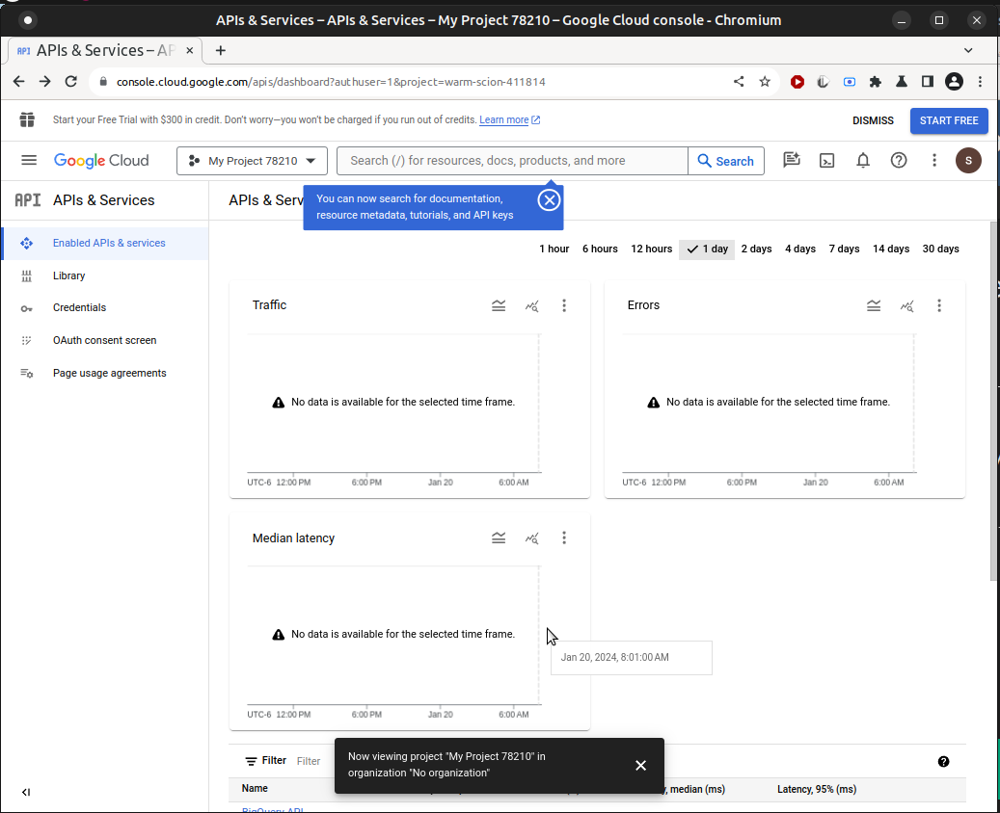
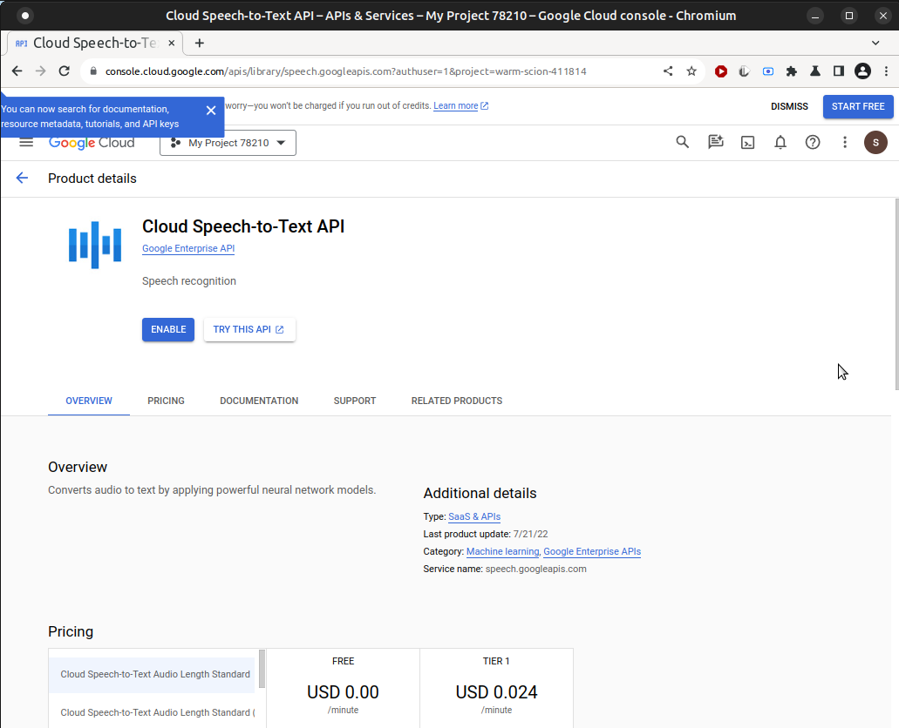
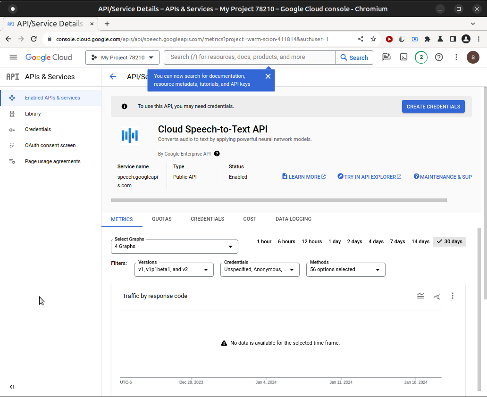
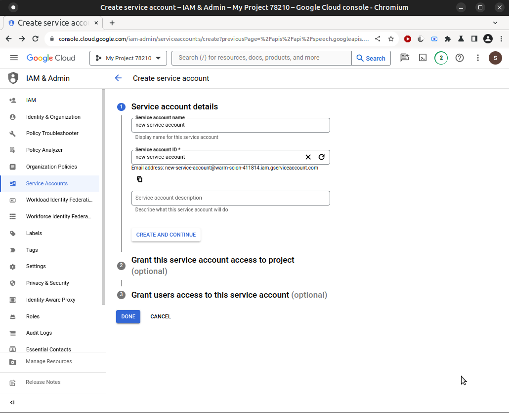
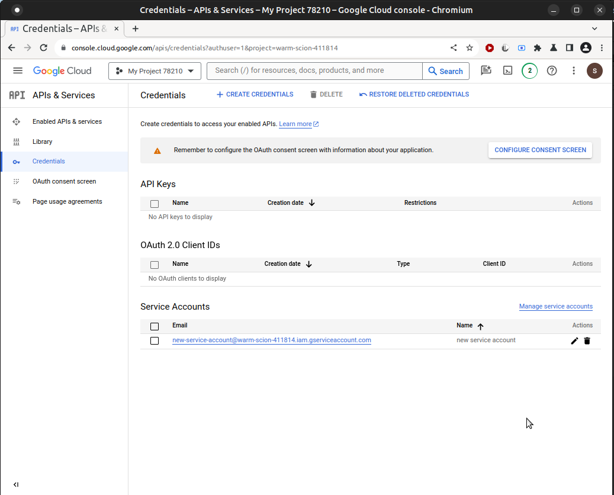
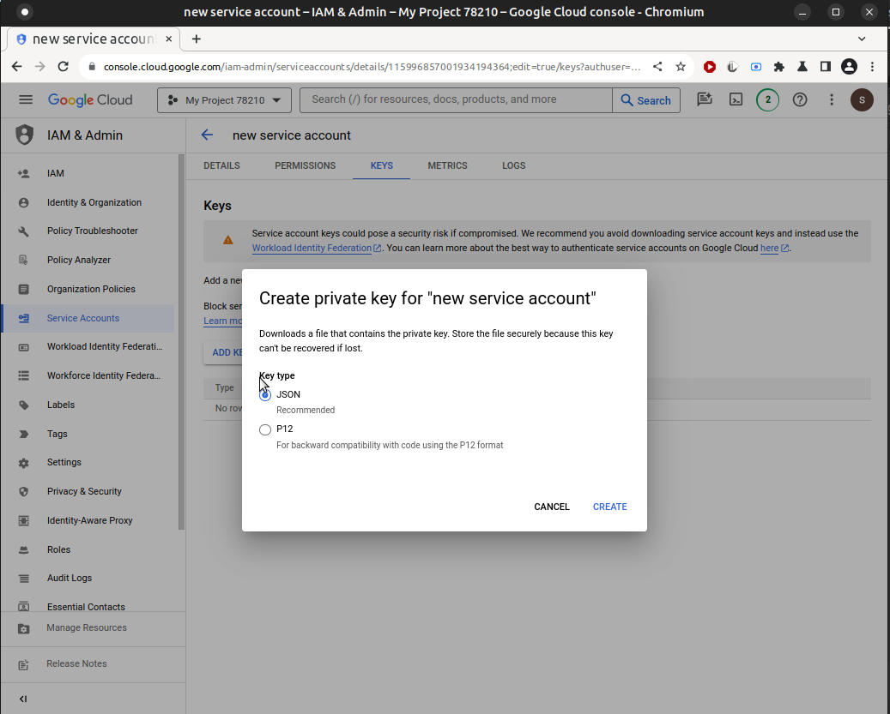

# Wyoming Google Streaming

[Wyoming protocol](https://github.com/rhasspy/wyoming) server for the [google-streaming](https://github.com/sdetweil/google-asr) speech to text system.

<!-- # Home Assistant Add-on

](https://my.home-assistant.io/redirect/supervisor_addon/?addon=core_google)

not yet (Jan 19, 2024)
[Source](https://github.com/home-assistant/addons/tree/master/google)
-->

## Local Install

Clone the repository and set up Python virtual environment:

```sh
git clone https://github.com/sdetweil/wyoming-google.git
cd wyoming-google
script/setup
```
## create the Google api Credentials file
See the section further down in this readme


## test run the speech to text using the microphone on this machine
execute the command<br>
```sh
test/run_mic2google.sh
```

this will take microphone audio and process it for text, and print out the text of the spoken words<br>
this confirms that the api is enabled, the billing account is setup and the service account <br>
credentials file is in the right place for these tests. 


Start a server 
```sh
test/run_test_server 
```

run a test recognize, using two pre-recorded wav files
```sh
test/run_client_wave2text.sh  server_address (default localhost, same machine as server)
```

this should produce this output from the 2 separate wav files
```text
testing testing testing testing
this is a test this is a test sometimes this is a test

```


## Docker Image
to create a local docker image for testing do
```
dockerbuild/makeit
```
this will build 2 images<br>
* AMD64 <br>
* ARM64/aarch64 <br>

to run the docker image for this platform, do 
```sh
docker image save wyoming-google


``` sh 
docker run -it -p 10555:10555 -v /path_to_credentials_folder:/config wyoming-google
```

or 
```
make -F dockerbuild/Makefile  run
```
if on mac, lowercase f 
```
make -f dockerbuild/Makefile  run
```


# to move this image to another system  do 
```sh
docker image save wyoming-google -o whateverfilename.tar 
```
copy the tar file to the other system and do 
```sh
docker image load whateverfilename.tar
```

[Source]
# this Wyoming extension is hosted at 
https://github/com/sdetweil/wyoming-google


## after starting an instance, with docker or scripted, to add this engine to the Home Assistant Assist panel, do
   ## use the settings/Integrations/Wyoming Protocol/
   

   ### use the host and port (default 10555) on the system you started the instance on. note if using docker, you must use the docker host ip address. 

   ####     note: you cannot edit services, only recreate them

## creating the Google api Credentials file
open the [Cloud Console](https://console.cloud.google.com/welcome)


you must create a billing account, for charging any usage overages. <br>
select the billing topic from the hamburger menu  next to **Google Cloud**<br>
see https://cloud.google.com/speech-to-text/pricing for current plans and pricing<br>

click the Projects dropdown, and dialog will open, with **New Project**  in the top right to create a new project, or select an existing project from the list 

Click NEW PROJECT

billing required popup

Enable billing for your project.<br>
Select the billing account you created above


[Enable the Cloud Speech API.]<br>
push the **Apis and Services** button 

apis landing page

then enter **speech** in the search box<br>
click search

ENABLE THE API - For more info see **Cloud Speech API Pricing** (for normal usage it will be free)

click **ENABLE**


Create a new service account, 
click **IAM and Services** in the hamburger menu next to Google Cloud<br>
click **Service Accounts**<br>

click **Create service account**
enter a service account name that will be memorable for you <br>
and description if you want<br>
click **DONE**

select the Credentials link in the **APIs and services** menu entry (from the hamburger menu  next to **Google Cloud**)



click **CREATE CREDENTIALS** and select **Service Account** (this gives you background callable usage of the enabled apis) 
click the name of the service account you just created<br>


click the **KEYS** tab

click **add key**


click **JSON**

click **CREATE** <br>
this will open the save as dialog to allow you to download and save the json file locally<br>

place the generated file into the **wyoming-google/config** folder as **credentials.json**

the name **MUST** be **credentials.json** 

## note: <br>
you cannot download the same credentials file again.<br>
you can create a NEW key and get a NEW file, only. 
