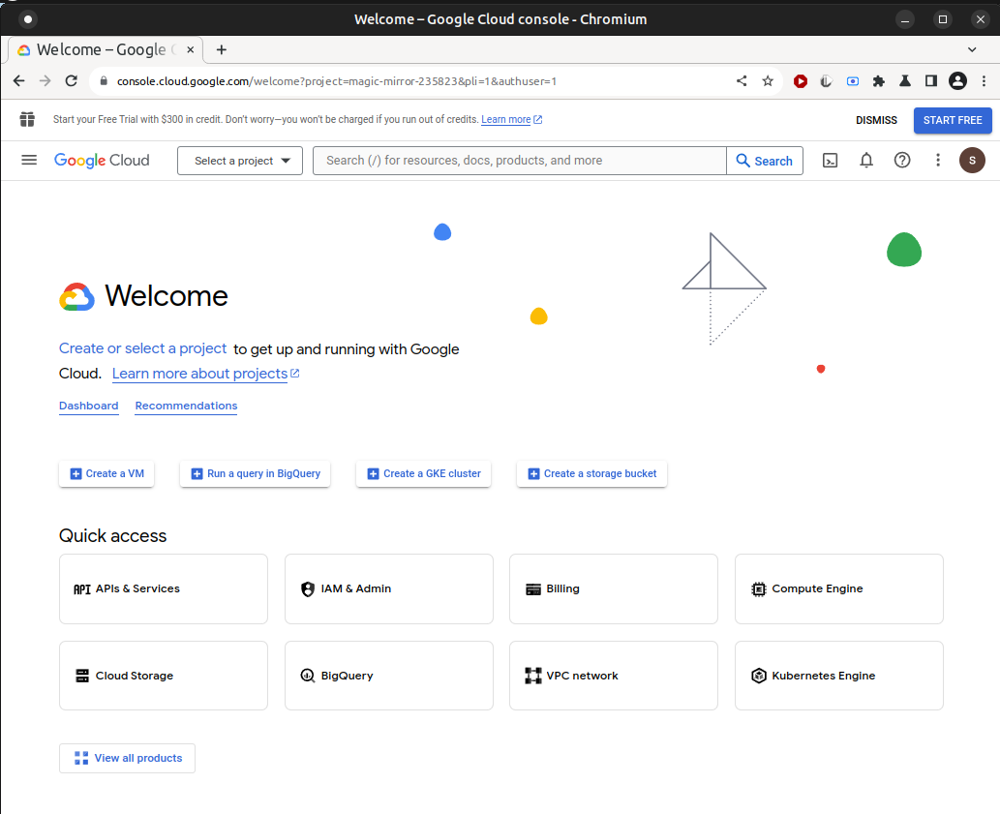

# Wyoming Google Streaming

[Wyoming protocol](https://github.com/rhasspy/wyoming) server for the [google-streaming](https://github.com/sdetweil/google-asr) speech to text system.

## Home Assistant Add-on

[](https://my.home-assistant.io/redirect/supervisor_addon/?addon=core_google)

# not yet (Jan 19, 2024)
[Source](https://github.com/home-assistant/addons/tree/master/google)

## Local Install

Clone the repository and set up Python virtual environment:

```sh
git clone https://github.com/sdetweil/wyoming-google.git
cd wyoming-google
script/setup
```
## create the Google api Credentials file
See the section further down in this readme


## test run the speech to text using the microphon on this machine
execute the command<br>
```sh
test/run_mic2google.sh
```

this will take microphone audio and process it for text, and print out the text of the spoken words<br>
this confirms that the api is enabled, the billing account is setup and the service account <br>
credentials file is in the right place for these tests. 


Start a server 
```sh
test/run_test_server 
```

run a test recognize, using two pre-recorded wav files
```sh
test/wave2text.sh
```

this should produce this output from the 2 separate wav files
```text
testing testing testing testing
this is a test this is a test sometimes this is a test

```


## Docker Image
# todo
# not yet (jan 19, 2024)
``` sh
docker run -it -p 10555:10555 -v /path_to_credentials_folder:/config rhasspy/wyoming-google \
     --language en 
```

[Source] (tbd)

## create the Google api Credentials file
open the [Cloud Cloud Console](https://console.cloud.google.com/welcome)


you must create a billing account, for charging any usage overages. <br>
select the billing topic from the hamburger menu  next to **Google Cloud**<br>
see https://cloud.google.com/speech-to-text/pricing for current plans and pricing<br>

click the Projects dropdown, and dialog will open, with **New Project**  in the top right to create a new project, or select an existing project from the list 

Click NEW PROJECT

billing required popup

Enable billing for your project.<br>
Select the billing account you created above


[Enable the Cloud Speech API.]
push the **Apis and Services** button 

apis landing page

then enter speech in the search box

ENABLE THE API - For more info see **Cloud Speech API Pricing** (for normal usage it will be free)

Create a new service account, 
select the Credentials link in the **APIs and services** menu entry (from the hamburger menu  next to **Google Cloud**)

click **Create credentials** and select **Service Account** (this gives you background callable usage of the enabled apis) 

enter a name of the service account that means something to you.
click Done

click the name of the service account you just created<br>
click the keys tab
click add key
click json

## loaded into the /config folder as credentials.json
this will open the save as dialog to allow you to download and save the json file locally<br>
the name needs to be **credentials.json** and placed in this project **config** folder

##note: <br>
you cannot download the same credentials  file again.<br>
you can create a NEW key and get a NEW file, only. 